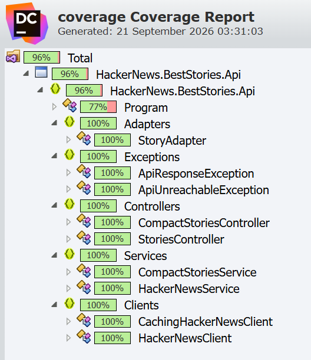

# Hacker News Best Stories API

This is an ASP.NET Core Web API which retrieves the best stories from the Hacker News API and returns the requested number of stories ordered by score.

The project was developed using .NET 9 and Visual Studio 2022.

## Running the application

1. Clone the repository.
2. Open the solution in Visual Studio 2022.
3. Restore the NuGet packages if Visual Studio has not done this automatically.
4. Set `HackerNews.BestStories.Api` as the startup project.
5. Run the application using F5 or Ctrl+F5.

Visual Studio will start the API and display the local HTTPS address, for example:

```text
https://localhost:7213
```

The compact endpoint can then be called using:

```text
GET https://localhost:7213/api/stories/best/compact?n=5
```

There is also a wider version of the response available at:

```text
GET https://localhost:7213/api/stories/best/wide?n=5
```

The tests can be run using Test Explorer in Visual Studio.

## Assumptions

I have made the following assumptions:

* `n` must be greater than zero (this is validated).
* The stories returned must be ordered by their Hacker News score, rather than relying on the order of the IDs returned by the Hacker News API.
* Because the score is part of the individual story data, the story details need to be retrieved before the final ordering can be made.
* Hacker News is an external dependency and can occasionally be unavailable or return temporary errors, so retry and error handling have been included.
* Story data does not need to be refreshed for every request. A cache is used to reduce unnecessary calls to Hacker News and to avoid multiple simultaneous requests retrieving the same data.
* My original wider story representation has been kept and the compact representation required by the specification has been added separately using an adapter.

## Testing

The solution contains unit and integration tests.

The tests cover the main behaviour of the application, including:

* communication with the Hacker News API;
* retry behaviour when requests temporarily fail;
* ordering stories by score;
* validation of the requested number of stories;
* conversion between the Hacker News story format and the compact API format;
* API endpoints and dependency injection;
* caching, including concurrent requests for the same data.

### Coverage

The current test coverage is shown below:



## Given more time

There are a few areas I would improve further given more time.

I would make the cache expiration settings configurable rather than keeping them in code, so they could be adjusted without rebuilding the application.

I would also improve the way story details are retrieved. They can be retrieved concurrently, but the number of simultaneous requests should be limited so that a cold cache cannot put unnecessary load on the Hacker News API.

For a system running on multiple servers, I would consider using a shared distributed cache so that all instances can reuse the same cached Hacker News data.

I would also add more monitoring around cache usage, response times and calls made to Hacker News, and run load tests to confirm the behaviour under a large number of concurrent requests.

## HackerNews API

- [Official Hacker News API documentation](https://github.com/HackerNews/API)
- `GET https://hacker-news.firebaseio.com/v0/beststories.json`
- `GET https://hacker-news.firebaseio.com/v0/item/{id}.json`

## License

[MIT](LICENSE)
